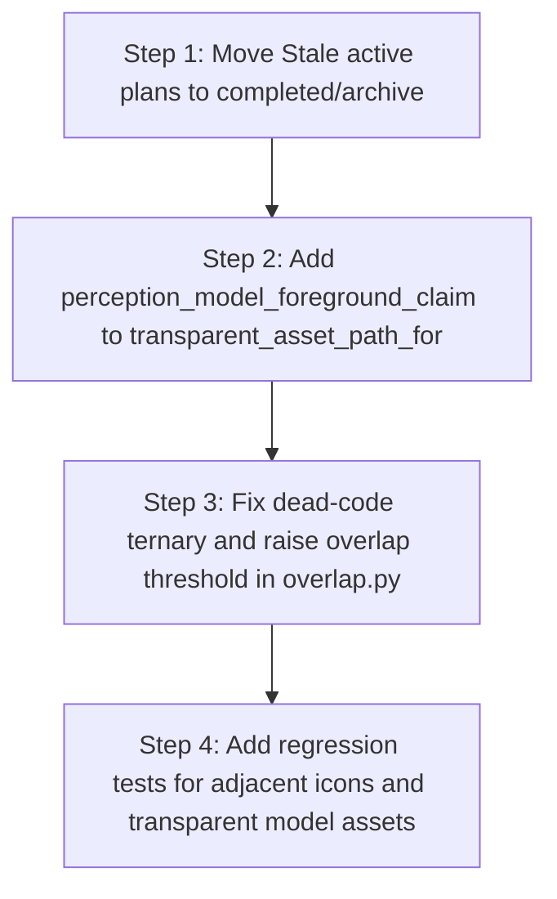

# 07 Prioritized Findings and Fix Plan

This document summarizes the findings from the M29 model-first mainline codebase review and outlines a sequential fix plan.

## Findings Ledger

### P1: Critical Defects (Correctness / Suppression Risk)

#### Finding P1-1: Aggressive icon/shape containment threshold (20% overlap)
* **Fact**: [overlap.py L76-78](file:///Volumes/WorkDrive/Code/github.com/LuQing-Studio/python/image-figma/backend/app/m29_replay_plan/overlap.py#L76-L78)
* **Inference**: For adjacent small icons, tab markers, and status dots, a 20% containment threshold on the *smaller* bbox area (`intersection / min(left_area, right_area)`) is easily triggered by minor bbox margins or alignment drift.
* **Risk**: Real adjacent elements are suppressed as `suppress_duplicate`, dropping them from the final Figma design.
* **Recommendation**: Raise the icon containment threshold to at least `0.45` or `0.50`, or separate icon-to-icon overlap suppression logic from standard large shapes.
* **Regression Guard**: Add a unit test verifying that adjacent tab icons with `25%` overlap are both preserved.

#### Finding P1-2: Dead-code redundant threshold ternary
* **Fact**: [overlap.py L77](file:///Volumes/WorkDrive/Code/github.com/LuQing-Studio/python/image-figma/backend/app/m29_replay_plan/overlap.py#L77)
* **Inference**: The ternary `threshold = 0.20 if left_action == "icon_replay" else 0.20` is redundant and always evaluates to `0.20` for both icons and shapes.
* **Risk**: Shapes are subject to the same aggressive suppression as icons, leading to missing background panels.
* **Recommendation**: Differentiate the thresholds (e.g. `0.35` for shape overlap vs `0.50` for icon overlap).
* **Regression Guard**: Run `pytest tests/test_m29_replay_plan.py`.

---

### P2: Medium Priority (Boundaries / Quality Gaps)

#### Finding P2-1: Dead code in C-stage structure materialization
* **Fact**: [structure.py L231, L275](file:///Volumes/WorkDrive/Code/github.com/LuQing-Studio/python/image-figma/backend/app/plan_materializer/structure.py#L231)
* **Inference**: The functions `build_group_node` and `replace_members_with_group` are never referenced or executed in the active mainline.
* **Risk**: Increases maintenance overhead.
* **Recommendation**: Retain them only if future grouping features are planned, or clean them up.
* **Regression Guard**: N/A.

#### Finding P2-3: `transparent_asset_path_for` excludes `"perception_model_foreground_claim"`
* **Fact**: [plan_materializer/replay.py L221-231](file:///Volumes/WorkDrive/Code/github.com/LuQing-Studio/python/image-figma/backend/app/plan_materializer/replay.py#L221-L231)
* **Inference**: The function only checks for `"m29_6_internal_icon_candidate"` and `"m29_6_foreground_claim"`.
* **Risk**: Model-promoted icons (carrying `"perception_model_foreground_claim"`) will fall back to standard pixel cropping in the materializer, losing their transparent alpha masks.
* **Recommendation**: Add `"perception_model_foreground_claim"` to the set of allowed promotion sources in `transparent_asset_path_for`.
* **Regression Guard**: Add a test in `test_m29_plan_materializer.py`.

#### Finding P2-4: Asymmetric text/icon overlap suppression
* **Fact**: [overlap.py L95-98](file:///Volumes/WorkDrive/Code/github.com/LuQing-Studio/python/image-figma/backend/app/m29_replay_plan/overlap.py#L95-L98)
* **Inference**: The logic `left_action == "text_replay" and containment_ratio >= 0.25` is asymmetric.
* **Risk**: If the sorting priority changes, icons could suppress text or vice versa in an unpredictable manner.
* **Recommendation**: Make the suppression check symmetric or document the sorting priority assumptions clearly.
* **Regression Guard**: Run `pytest tests/test_m29_replay_plan.py`.

#### Finding P2-5: Materializer hardcodes Inter font and left alignment
* **Fact**: [plan_materializer/replay.py L75-77](file:///Volumes/WorkDrive/Code/github.com/LuQing-Studio/python/image-figma/backend/app/plan_materializer/replay.py#L75-L77)
* **Inference**: Replayed text elements always get `"Inter"` font and `"left"` text alignment regardless of source evidence.
* **Risk**: Font style formatting is ignored.
* **Recommendation**: Document this as a known limitation of the current MVP layout builder.
* **Regression Guard**: N/A.

---

### P3: Low Priority / Documentation Debt

#### Finding P3-2: Stale active plans in active plans directory
* **Fact**: [docs/plans/active/](file:///Volumes/WorkDrive/Code/github.com/LuQing-Studio/python/image-figma/docs/plans/active/)
* **Inference**: Contains 8 completed or superseded plan documents.
* **Risk**: Misleads future development agents.
* **Recommendation**: Move these 8 plans to `completed/` or `archive/` in a dedicated doc-maintenance task.
* **Regression Guard**: N/A.

---

## Hardening Fix Plan

Since the audit is strictly read-only, **no changes should be made to runtime code in this turn**. However, when a cleanup or stabilization task is approved, the changes should be executed in the following order:

1. **Step 1 (P3-2)**: Clean up `docs/plans/active/` to avoid misleading subsequent agents.
2. **Step 2 (P2-3)**: Fix `transparent_asset_path_for` in `plan_materializer/replay.py` to support perception model transparent assets.
3. **Step 3 (P1-1 & P1-2)**: Fix the ternary and raise the containment threshold in `overlap.py` to prevent aggressive icon suppression.
4. **Step 4 (Validation)**: Run the full test suite and add regression guards for adjacent icons and model-based transparent assets.
