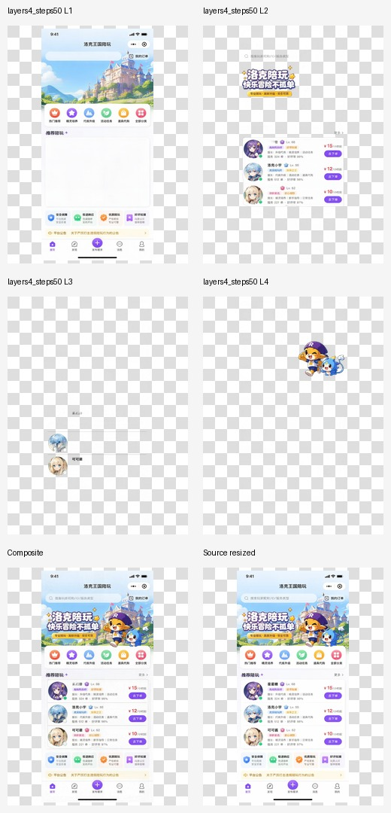
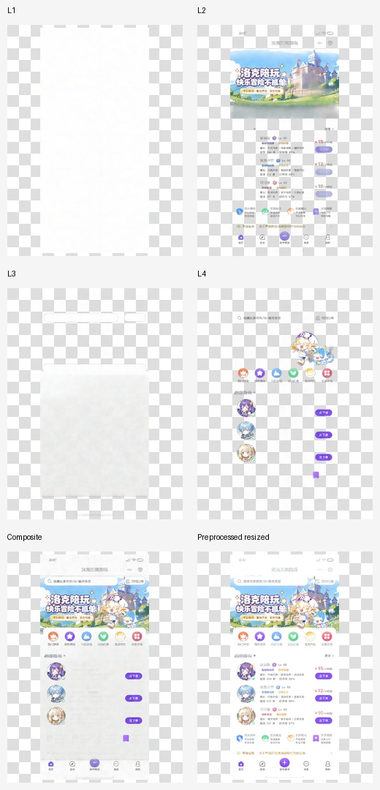
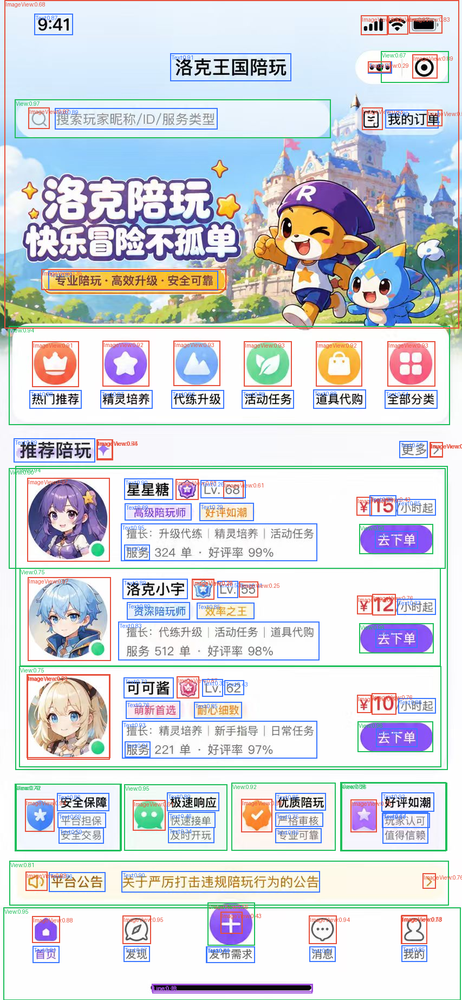
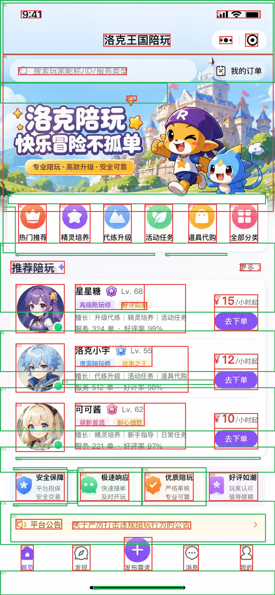
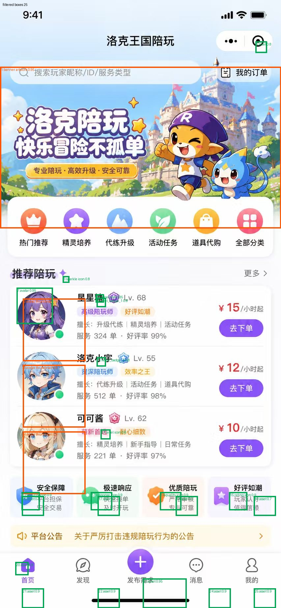
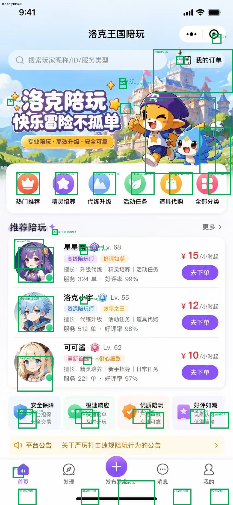
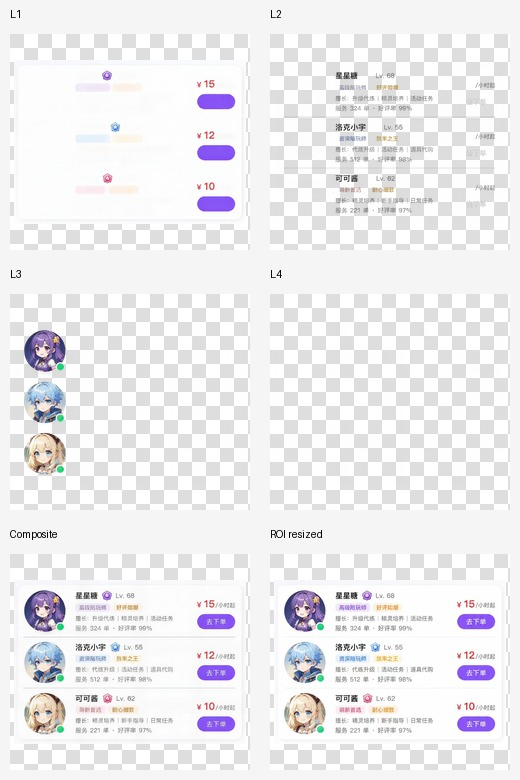
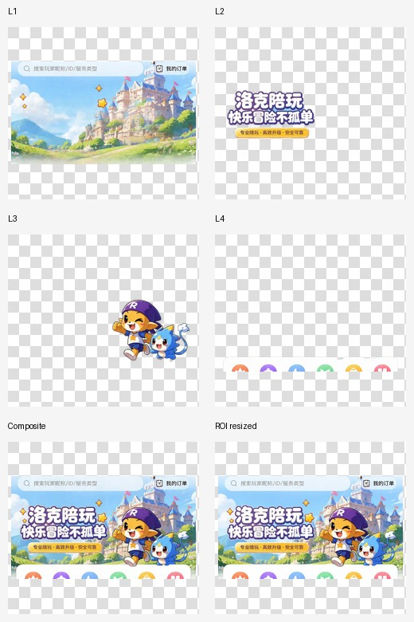
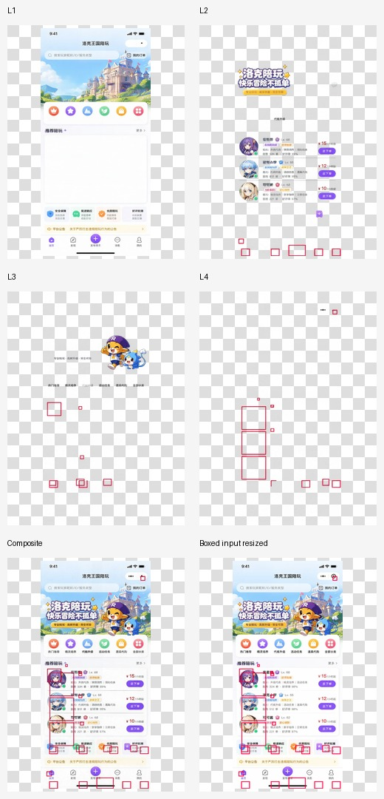
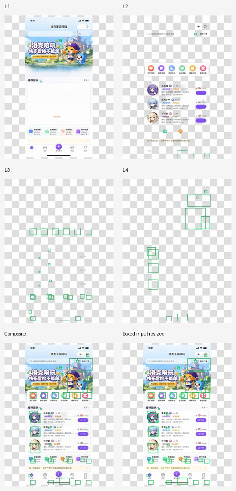

# Qwen Layered Evidence Experiment

Date: 2026-06-26
Plan: `docs/plans/active/208-qwen-layered-evidence-experiment.md`

## Judgment

Qwen-Image-Layered is useful as a coarse pixel-ownership layer generator, but it is not a UI detector and not a Codia replacement by itself.

The best route from this sample is:

```text
GPT / mainline AI boxes or YOLO View boxes
-> select ROI from the original clean image
-> run Qwen-Image-Layered recursively per ROI
-> threshold / denoise Qwen alpha masks
-> map masks and boxes back to original resolution
-> OCR/text-style/M29 handle editable text
-> Draft layer graph / review owns final decisions
```

The bad route is:

```text
draw boxes on top of the original
-> send annotated image to Qwen
```

Qwen treats the drawn boxes as real visual content and preserves them as layers. It does not reliably interpret them as instructions.

## Sample

Source image:

```text
/Users/luhui/Library/Containers/com.tencent.xinWeChat/Data/Documents/app_data/xwechat_files/wxid_bzp8y3r5qua022_8778/temp/RWTemp/2026-06/6c5f250424fe9df975d60577d700a448.jpg
```

Source size:

```text
853 x 1844
```

All raw experiment artifacts are under:

```text
/private/tmp/qwen-layered-probe/
```

See `artifact-index.json` for exact paths and metrics.

## Route Results

### 1. Full-Image Qwen Baseline

MoArk endpoint:

```text
https://api.moark.com/v1/images/layers
model=Qwen-Image-Layered
layers=4
```

Observed API limit:

```text
layers must be 1..4
```

Full-image 15 steps:

```text
elapsed: 34.19s
output: 448 x 928
MAE: 8.864
PSNR: 24.35
```

Full-image 50 steps:

```text
elapsed: 56.63s
output: 448 x 928
MAE: 6.599
PSNR: 25.99
```

50 steps is visibly cleaner, but still coarse. It separates broad semantic layers such as background, hero/title/list, avatars, and main characters. It does not split a UI into component layers.



### 2. M29 Evidence

M29 on this screenshot produced:

```text
primitiveCount: 465
symbol_region: 446
image_region: 6
rect: 3
unknown_region: 3
line: 7
```

This confirms the user's concern: M29 is too fragmented to be the primary layer source. It is useful as physical evidence for small icons, edges, text-adjacent fragments, and validation, but not as the main decomposition driver.

M29 foreground-on-white preprocessing was also tested before Qwen. It made the result worse because it removed contextual image cues and pushed Qwen toward odd semi-transparent backing layers.



### 3. Deki YOLO Evidence

Deki YOLO detected:

```text
candidateCount: 130
ImageView: 49
View: 19
Text: 60
Line: 2
```

The overlay shows YOLO is useful for structure navigation: View regions, avatars, icons, buttons, and text regions are visible. But it is not a final layer generator. When passed through the legacy PSD-like v3 ownership filters, no Deki `ImageView` candidate became an accepted raster owner.

```text
dekiImageViewRasterPassCount: 36
dekiImageViewRasterAcceptedCount: 0
```



### 4. PSD-Like Baseline

PSD-like deterministic decomposition without OCR produced:

```text
raster: 43
shape: 22
text: 0
rejected: 44
```

It gives more layer-like boxes than M29, but it is still heuristic and can over-own text/card regions. It is useful as a comparison and fallback evidence source, not as the leading strategy.



### 5. Mainline GPT AI Boxes

The current Slice Studio AI box route was run directly against the sample, using the production prompt/tile logic:

```text
tileCount: 7
elapsed: 118s
rawBoxCount: 42
acceptedBoxCount: 25
rejectedBoxCount: 17
```

Compared with YOLO, GPT boxes are fewer and semantically cleaner. It identifies hero artwork, avatars, badge icons, feature icons, bottom navigation icons, and other export-worthy assets.

Problem: the existing production filter is asset-oriented. It intentionally excludes many container / row / card regions. For Qwen recursion, the raw tile boxes or a separate ROI prompt is more useful than the final accepted asset boxes.





### 6. ROI -> Qwen Recursive Decomposition

Three ROI inputs were created from detector evidence:

```text
category_strip: Deki YOLO View region
recommendation_list: Deki YOLO View region
hero_region: M29 image_region
```

Qwen was then run on each clean original crop, not on an annotated image.

Runtime:

```text
category_strip: 60.80s
recommendation_list: 99.09s
hero_region: 51.19s
```

This is the best route tested. It increases effective layer granularity because each ROI receives up to 4 Qwen layers. The recommendation list crop separates avatars, text/list content, and price/buttons better than the full-page call. The hero crop separates background, title, characters, and category fragments better than full-page call.





### 7. Draw GPT Boxes On Image -> Qwen

Two annotated-image routes were tested:

```text
gpt_filtered_no_giant_outline: 24 GPT boxes, giant banner box removed, 58.90s
gpt_tile_only_outline: 38 tile boxes, 123.51s
```

This route is not good. Qwen treats the red/green outlines as real image content and emits layers containing the drawn boxes themselves. It does not reliably use the boxes as guidance for segmenting the underlying UI content.





## Ranking

Current ranking for this sample:

```text
1. GPT/YOLO ROI selection -> clean original crop -> Qwen recursive layers
2. Full-image Qwen 50 steps as coarse background/hero/list ownership evidence
3. Mainline GPT boxes as semantic asset / ROI evidence
4. YOLO View/Image/Text boxes as structure evidence
5. PSD-like deterministic layer decomposition as fallback/audit evidence
6. M29 as low-level physical evidence only
7. Drawn-box annotated image -> Qwen
8. M29 foreground-on-white image -> Qwen
```

## Proposed Restart Architecture

The old Draft route should be restarted as an evidence-fusion pipeline, not as a single-model miracle:

```text
Input screenshot
-> GPT ROI detector prompt for regions and export-worthy assets
-> optional YOLO View/Text/Image evidence for fast structure hints
-> Qwen full-image coarse layer pass
-> Qwen recursive ROI layer passes
-> alpha threshold / connected components / denoise
-> high-resolution mask remap to original image
-> OCR + text-style + M29 for editable text and text bbox evidence
-> Draft editable_layer_graph.v1
-> review gate
-> renderer / Pencil / Figma output
```

Do not feed drawn annotations to Qwen as a default path. Use boxes as structured control data in our own wrapper:

```text
box -> crop -> Qwen -> remap
```

not:

```text
box -> draw on image -> Qwen
```

## Open Engineering Questions

- Mainline GPT prompt needs a second mode: `roi_regions`, not just export-worthy asset boxes.
- Qwen output is downsampled to 448x928 for this sample. Final assets must come from original pixels using remapped masks, not from Qwen PNG RGB directly.
- Qwen alpha masks have low-opacity full-canvas noise. Every route needs thresholding, denoising, connected components, bbox extraction, and NMS.
- Recursive Qwen calls are expensive. This sample used multiple 50-step calls, with some ROI calls taking up to 123.51s. This must be an async job, not an interactive request.
- OCR/editable text remains separate. Qwen and YOLO should not own editable text reconstruction.

## Next Move

Implement a local experiment wrapper before touching production:

```text
scripts/experiments/qwen-layered-fusion/
  1_detect_gpt_rois.ts
  2_run_qwen_layers.py
  3_extract_masks.py
  4_build_draft_graph.ts
  report.md
```

The first product-grade milestone should not be "automatic Codia". It should be:

```text
one screenshot
-> GPT ROI boxes
-> recursive Qwen layers
-> remapped high-res raster layer candidates
-> editable OCR text candidates
-> inspectable Draft graph
```
