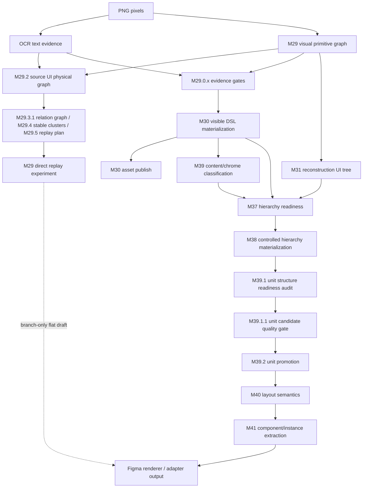

# Image-to-Figma Roadmap

- 状态：active
- 日期：2026-05-22

## Purpose

本文档固定项目从 M29 换方向之后的完整演进路线，避免后续工作在黑条、搜索框、轮播图、模型接入、组件化、代码生成之间来回跳。

当前路线不是“先组件化”，也不是“继续给每张样图打补丁”。正确主线是：

```text
像素拓扑与归属
-> 可见图层
-> 通用关系图
-> 稳定设计簇
-> layout semantics
-> component/instance
```

第一性原理边界：

```text
PNG 像素是输入真相源。
M29 的第一职责是把扁平 PNG 拆成像素集合、集合关系和唯一 owner。
M30/M31/M37/M38/M39 产物是证据链和中间结构。
模型、Figma MCP、UIC/Codia schema 都只能提供候选或参考，不能直接成为内部真值源。
```

M29 的根不是 UI component detector。它不应该先输出 SearchBar、ProductCard、BottomNav 或 Banner。M29 的根是 pixel topology graph：

```text
node = bbox / mask / metrics / source evidence
edge = disjoint / overlaps / contains / contained_by / near_equal / near / aligned / repeated / protects / conflicts
owner = editable_text / raster_media / raster_icon / shape_geometry / fallback_only / diagnostic_only
```

硬不变量：

```text
同一块 source foreground evidence pixel / replay foreground pixel 只能有一个 replay owner。
```

这条不变量优先级高于所有下游 grouping、unit promotion、layout semantics 和 componentization。它不禁止 Figma layer bbox 重叠；背景 shape 可以和 child text/image/icon 在空间上重叠，因为它们拥有不同 source evidence。

## Active Branch Experiment

### M29 Direct Replay

当前在 `experiment/m29-direct-replay` 分支验证一条旁路：

```text
source PNG + OCR text boxes + M29 visual primitive graph
-> flat DSL v0.1
-> existing renderer
```

这个实验的目标是判断 M29 的强像素拆分能力是否可以先生成一个高保真、可编辑、可拖动的 flat draft。它不是默认主链路，不替换 M30/M37/M38/M39，也不做 Auto Layout、Component/Instance 或代码生成。

第一版判断标准：

- OCR text 成为 editable text。
- M29 image/symbol/simple shape 成为独立可拖 layer。
- OCR text 压制重叠 raster primitive，避免文字重复。
- fallback 对 replayed bbox 让位，避免明显重影。
- visible node 数量受预算保护，避免图层爆炸。

如果 M29 direct replay 效果好，后续可以把它发展为 experimental draft path，再让 M30/M37/M38/M39 成为质量门、结构增强和组件化前置诊断。如果效果不好，保留实验证据，继续当前 M39.1.1 -> M39.2 主线。

### Figma Compare Mode

M29 direct 的路线判断不能只看 report。当前分支新增 compare mode：

```text
one PNG upload
-> one backend task
-> M29 direct flat DSL
-> current mainline DSL
-> Figma side-by-side render
```

左侧是 `M29 Direct Replay / {filename}`，右侧是 `Current Mainline / {filename}`。这让验收回到真实目标：能不能在 Figma 里选中、拖动、编辑、检查重影和图层混乱度。

Compare mode 不是默认路线切换。`Generate from PNG` 仍然只渲染当前主线 DSL；`Generate Compare` 才渲染双路线。

### M29.2 Source-Level UI Physical Graph

M29 direct compare 暴露的下一层问题不是缺少 unit promotion，而是源头像素归属仍然太粗。M29.2 在 direct replay 前新增 source-level ownership gate：

```text
PNG + OCR + M29 primitive evidence
-> source objects with visualKind / pixelOwner / replayDecision
-> safer M29 direct replay
```

当前最高杠杆验证是 M29.2 direct-path source validation，而不是继续推进 M39.1.1/M39.2。M39.1.1/M39.2 保留为主线后续，但在 M29 direct 路线判断完成前不作为下一优先级。

M29.2 的第一性原则：

- 普通 UI text 才变 editable text。
- 艺术字、商品图内部字、banner 内部字优先保留 raster。
- 小 icon fragments 先合并成 raster icon，再 replay。
- UI 背景/分割线才作为 shape geometry replay。
- fallback 只擦除已安全 replay 的 bbox。
- 不接模型、不做单点 hack、不替换主线 `/dsl`。

M29.2 之后的直接后续路线：

```text
M29.3.0 Region Relation Kernel
-> M29.2.1 Pixel Ownership Consistency
-> M29.3.1 Region Relation Graph Report
-> M29.4 Stable Design Cluster
-> M29.5 Replay Engine V2
-> M29 default path decision
```

M29.3.0 是无状态几何 kernel，先定义两个区域之间的 primary set relation 和 secondary geometry relations。M29.2.1 消费这个 kernel，修 copied raster asset、editable text 和 fallback 之间的重复 ownership。M29.3.1 才把所有 source regions 的关系输出成 graph/report。M29.4 只消费这个只读关系图，聚合稳定设计簇报表，不做组件化、不改 DSL、不改可见输出。UI 语义名只能作为弱 role hint，不能成为 M29 真值源。

M29.5 是 M29 direct 左侧实验路径的 replay quality gate。它把 M29.2 ownership、M29.3.1 relation graph 和 M29.4 stable clusters 收束为 `m29_5/replay_plan.json`，再由 `m29_direct_replay` 消费。M29.5 不创建 DSL 节点、不改 assets、不做组件化、不切换默认 `/dsl`。

M29 Direct 当前质量修复只收物理问题：replay 可见层级统一为 `shape/support/background -> image -> icon -> text`，raw M29 对低对比 support region 产生 `low_contrast_support` shape，并把 raw M29 shape 的 `style.radius` 传到 M29 Direct DSL。低对比 support 使用局部稳定填充、内外环颜色差异、OCR text 和同线 foreground evidence，不使用 `SearchBar` 语义名，也不假设支撑区域必须是白色。shape style preservation 只传递/估计 radius，不做 full style reconstruction。OCR-symbol leakage、小型纹理 foreground ownership 和组件化继续留在后续阶段。

M29.2.1 的 ownership 层先定义 6 类 owner：

```text
editable_text
raster_media
raster_icon
shape_geometry
fallback_only
diagnostic_only
```

owner 不使用全局静态优先级。普通 UI text 可以赢过 copied raster asset；media 内部艺术字/海报字必须留在 raster_media。fallback 不是竞争 owner，只是安全层；cleanup 只能跟随 replay-safe ownership。

editable_text ownership 还必须满足 cleanup feasibility。如果文字位于高纹理/渐变 media 内部，而当前只能做 solid-fill cleanup 并会留下明显补丁，则第一版必须 preserve_in_parent_raster。

M29.3.0 的第一块不是 cluster，而是定义两个区域之间的基础关系 kernel：

```text
relation(A, B) -> {
  primarySetRelation,
  secondaryGeometryRelations
}
```

其中 `A` 和 `B` 都是 `[x, y, width, height]`。`primarySetRelation` 负责高中数学里的集合关系：

```text
near_equal
contains
contained_by
overlaps
disjoint
```

`secondaryGeometryRelations` 负责空间和方向关系：

```text
near
left_of / right_of / above / below
aligned_left / aligned_center_x / aligned_right
aligned_top / aligned_center_y / aligned_bottom
same_width / same_height / same_size
```

第一版只用 bbox 几何，先固定面积、交集、包含比例、近似重合、方向/对齐和判断顺序。`near_threshold` 必须 relative、thin-aware、capped：不能被 1px 细线短边拖垮，也不能因为长分割线产生无限吸附距离。这个 kernel 稳定之后，才能往 ownership、relation graph、cluster 和 component candidate 走。

组件化不是最后的像素去重。组件化必须建立在 M29.3/M29.4 的集合关系图和稳定设计簇之上：

```text
primitive = pixel set
relation = set relation + geometry relation + appearance relation
cluster = local stable relation subgraph
component candidate = repeated near-isomorphic cluster graph
component = template + slots + instances + overrides
```

因此 component/instance 阶段只能在 slot matching 可解释、实例差异可作为 override 保留之后执行。相同像素、相同文本、相同 UI 名字都不能单独构成组件真值源。

组件候选还必须保留方向和 layout flow。横向 `icon left_of text` 和纵向 `icon above text` 不能因为 child type 相同而被合并成同一个 component template。

### Deferred Contracts After M29.2.1/M29.3/M29.4

以下问题先进入路线图，不在当前讨论阶段展开。等 M29.3.0 relation kernel、M29.2.1 pixel ownership consistency、M29.3.1 generic relation graph 和 M29.4 stable design cluster 这些块完成并有 Figma Compare 证据后，再逐项打开。

1. Source region 最小数据结构

   需要定义每个 region 的必备字段，例如：

   ```text
   id
   bbox
   sourceKind
   sourceIds
   metrics
   text?
   assetPath?
   confidence
   relations?
   owner?
   replayDecision?
   ```

2. M29.2.1 第一版执行边界

   需要决定第一版是否只修：

   ```text
   text inside copied media asset cleanup
   fallback follows replay-safe cleanup
   preserve_raster_text 不擦
   source PNG / raw M29 asset 不改
   ```

   还是同步处理 icon fragment ownership。默认倾向先窄后宽。

3. M29.3.1 v1 relation graph 范围

   M29.3.1 v1 已收口为只读 pairwise relation graph report。它消费 M29.2 `sourceObjects`，使用 M29.3.0 `classify_region_relation(...)` 输出全量 pairwise edges，并写入：

   ```text
   storage/m30_1_uploads/{taskId}/m29_3/region_relation_graph_report.json
   ```

   v1 输出以下关系：

   ```text
   near_equal
   contains
   contained_by
   overlaps
   disjoint
   near
   aligned
   above / below / left_of / right_of
   same_size
   ```

   v1 不输出聚合关系，也不推导组件或 role hint。以下关系留到 M29.4 或之后，必须建立在稳定 relation graph 证据之上：

   ```text
   same_gap
   repeated
   similar_color
   ```

4. Source physical graph semantic leakage cleanup

   当前实现中如果 source-level physical graph 输出 `card_background`、`control_background` 这类 UI semantic visualKind，后续 M29.3.0/M29.2.1 实现阶段需要迁移为物理命名，例如：

   ```text
   large_container_geometry
   small_container_geometry
   thin_line_geometry
   ```

   这属于 implementation cleanup，不在当前文档审定阶段修改代码。

5. M29 Direct 默认 draft path 切换标准

   等 M29.2.1/M29.3/M29.4 有结果后，再定义 M29 Direct 从 compare 左侧实验变成默认 draft path 的硬指标，例如：

   ```text
   普通文字可编辑率
   明显重影数量
   visible node 数量
   asset 加载失败数
   fallback cleanup 错误数
   Figma Compare 人工通过样本数
   ```

## Direction Change

M20-M28 证明了单独追 icon crop、SAM mask、provider benchmark、局部视觉候选不能形成稳定 Figma 输出。截图是扁平渲染结果，不能从“裁几个 icon”直接跳到可编辑设计稿。

从 M29 开始，项目方向改成：

```text
先建立可审计视觉证据
再保守物化可信图层
再建立结构和层级
最后才做 layout / component
```

这个方向替代了早期“局部补图标/补切片”的路线。

## End-to-End Data Flow



## Completed Mainline

### M29 Visual Primitive Evidence Layer

目标：从 PNG 像素建立可审计 primitive evidence，而不是直接猜 Figma 图层。

关键产物：

```text
text / shape / image / symbol / unknown primitive graph
debug overlays
preview sheets
lineage metadata
```

核心原则：

- M29 不是 Renderer 输入。
- M29 不直接改变 Figma 输出。
- text boxes 是排除和归属证据，不是最终可编辑文字真值。
- image/symbol/mixed evidence 只进入后续 gate，不绕过安全门。

### M29.0.x Evidence Normalization And Ownership Gates

目标：把 M29 的原始 primitive 变成更可靠的候选证据，避免文字、图标、图片互相污染。

关键阶段：

```text
M29.0.2 text-masked media audit
M29.0.3 visual evidence normalization
M29.0.3.1 text-rejected lineage feedback gate
M29.0.3.2 residual mixed boundary review
M29.0.4 generic visual object candidate audit
M29.0.5 text-aware visual object refinement
M29.0.6 member boundary quality audit
M29.0.7 text ownership gate
```

核心原则：

- audit-only 阶段不能直接生成可见 DSL 节点。
- 被 text ownership 判定为文字的证据不能再作为 visual asset 混入。
- mixed 或 residual candidate 必须先有 lineage 和 risk 分类，不能直接 promotion。

### M29.1 Symbol Lineage And Fragment Grouping

目标：保留 symbol/icon 证据的来源链，减少 OCR/text overlap 对小图标证据的破坏。

关键阶段：

```text
M29.1 symbol fragment grouping
M29.1.1 pre-OCR symbol lineage audit
M29.1.2 symbol lineage survival contract
M29.1.3 mixed symbol/text conflict classification audit
```

核心原则：

- 小图标和文字相邻时先保留 lineage，不急于生成可见层。
- mixed symbol/text conflict 只分类，不绕过 M30 安全物化。

### M30 Evidence-Grounded DSL Materialization

目标：把可信 M29.0.5 evidence 保守物化为 DSL v0.1 可见图层。

关键能力：

```text
m30_text_member
m30_shape_candidate
m30_visual_asset
m30_composite_media_asset
fallback preservation
asset publish
materialization report
```

核心原则：

- M30 是从 evidence 到 visible DSL 的桥。
- M30 复用现有 DSL/Renderer，不创建另一个 DesignScene schema。
- fallback 必须保留，局部失败不能拖垮整页。
- safe visual/text/image 才能 materialize。
- `fallback_region` / `original_reference` 是根层保护对象，不参与结构移动。

### M30.6 Accepted Image Asset Materialization

目标：让低文字重叠、来源可追溯的大商品图成为独立 image layer。

解决的问题：

```text
M29.0.5 已有大 image_asset
M30 旧 safe_visual_text_overlap_max=0.0 导致低文字重叠大图被跳过
最终 DSL 没有独立商品图层，后续 M37/M38 无节点可组
```

核心原则：

- 不全局放宽 icon/visual asset 的安全阈值。
- 只对大 `image_asset` 使用 accepted-image policy。
- 补齐 M29 lineage，让 M37 direct-match 有 source id 可交叉。

### M30.7 Raster Layer Deduplication For Materialized Media

目标：解决“可拖图层”和“像素无重影”的物理冲突。

解决的问题：

```text
商品图已被物化，但商品图 PNG 内仍有烘焙文字
上层又有可编辑 text node，拖走文字后露出重影
轮播图是 partially_separated composite media，M30.6 不会物化
```

核心能力：

- 只清洗 M30 copied image asset，不修改 M29.0.5 原始资产。
- 对完全落在商品图内部的上层 editable text bbox 做局部补底。
- 把大面积 composite media 物化为 `m30_composite_media_asset`。
- fallback 对已物化大图和 composite media 区域让位。

### M31 Reconstruction UI Tree

目标：从 M29 primitive evidence 组织 reconstruction units，为层级恢复提供诊断结构。

核心原则：

- M31 是 evidence organization 层，不是 Renderer 输入。
- M31 unit ownership 基于 primitive evidence，不等同于 M30 visible node ownership。
- M31 可以解释“哪些砖头可能属于同一个房间”，但不能直接当 Figma 层级真值。

### M37 Hierarchy Readiness

目标：审计 M31 units 能否映射到 M30 visible nodes。

核心原则：

- M37 是 read-only readiness report。
- 只有 direct-match 等强证据能进入安全层级候选。
- geometry-only match 只能做诊断，不能做 product truth。
- micro-unit、duplicate bbox、unsupported visual kind、lineage gap 都必须阻断。

### M38 Controlled Hierarchy Materialization

目标：只把 M37 判定安全的 direct-match units 物化成透明 group。

核心原则：

- 只移动 safe direct-match child。
- 保持绝对坐标零漂移。
- 不移动 `fallback_region` / `original_reference`。
- 不做 nested hierarchy。
- 不做 Auto Layout。
- 不做 Figma Component/Instance。

### M39 Content-Chrome Boundary Classification

目标：区分 content 和系统 chrome/外壳，防止跨边界混组。

核心原则：

- 只分类 M30 可见节点。
- `fallback_region` 和 `original_reference` 永远不参与。
- ONNX 模型只能作为候选 proposer，不能绕过几何安全规则。
- M37 遇到 content/chrome 混合 unit 必须 unsafe，M38 必须跳过。

### M39.1 Unit Structure Readiness Audit

目标：解释为什么现在只有砖头和少量房间，而不是完整 UI 结构。

核心原则：

- report-only。
- 不改 DSL，不改资产，不创建节点。
- 汇总 existing safe unit、micro unit、product-card/banner/chrome/content candidates、blocker taxonomy 和 promotion hints。
- ONNX box candidate 只能 diagnostic，不能直接成为 unit truth。

当前发现：

- product-card 候选数量不少，但有小 icon、小图片碎片、重复 bbox、micro unit。
- 所以下一步不是 M40，也不是组件化，而是先做候选质量门。

## Current Baseline

当前已经稳定的能力：

- 主要文字可以物化为可编辑 text。
- 商品图和大 composite media 可以物化为独立 image layer。
- 商品图内已被上层 text 覆盖的烘焙字可以在 M30 copied asset 里局部去重。
- 部分 direct-match unit 可以被 M38 安全成组。
- content/chrome 边界可以阻止明显错误混组。
- M39.1 可以报告结构候选和阻塞原因。

当前还没有稳定的能力：

- 高质量 unit candidate gate。
- 可靠 unit promotion。
- layout semantics / Auto Layout hints。
- Figma Component / Instance。
- 前端代码生成。

## External Reference Boundary

Codia 公开资料显示的路线更接近：

```text
input image
-> unified VisualElement/DSL
-> childElements
-> layoutConfig
-> optional componentSpec
-> Figma/code adapter
```

对本项目的启发：

- 不应把“Figma Component/Instance”当成下一步起点。
- 正确顺序是先得到可信 UI unit，再推断 layout，再提取 component。
- Figma MCP 能把已有 Figma 图层树转成 HTML/CSS，但它不能替代 `PNG -> DSL -> Figma` 的逆向识别链路。
- UIC/Codia schema 可作为架构参照，不应直接变成内部主合同。

## Forward Roadmap

### M39.1.1 Unit Candidate Quality Gate

目标：让 M39.1 的候选 unit 先变可信，再谈 promotion。

性质：

```text
report-only
no DSL mutation
no asset mutation
no visible Figma output change
```

核心工作：

- 给 `candidateUnits[]` 增加质量字段，例如 `promotionReady`、`qualityTier`、`qualityReasons`、`rejectReasons`、`duplicateOfCandidateId`。
- 拒绝小 icon / 小图片碎片伪装成 product card。
- 拒绝 content/chrome 混合候选。
- 去重高 IoU / 反向重复候选。
- 只把 `promotionReady=true` 的候选写进 `promotionHints[]`。

退出条件：

- M39.1 report 里的 promotion hints 不再由小碎片和重复候选主导。
- product card、banner、chrome shell、content section 候选都有明确质量理由。
- `dslChanged=false`、`createdVisibleNodeCount=0`、`assetChanged=false` 保持不变。

### M39.2 Unit Promotion

目标：只把 M39.1.1 质量门通过的高置信 unit 提升为可消费结构。

性质：

```text
controlled DSL structure change
transparent unit container creation
zero visual drift required
```

核心工作：

- 消费 `promotionReady=true` 且 `qualityTier in {"high", "medium"}` 的候选。
- 生成通用 unit container，例如 `product_card`、`banner`、`top_chrome`、`bottom_chrome`、`content_section`。
- 保持所有叶子节点绝对位置等价。
- 继续禁止移动 `fallback_region` / `original_reference`。
- 不引入 Auto Layout，不创建 Figma Component/Instance。

退出条件：

- 新增 unit container 后，报告仍保持 `absolutePositionViolationCount=0`。
- 用户可拖动的 unit 数量上升，但没有明显错误混组。
- 黑条、搜索框、轮播图只能作为通用 chrome/banner/content-section 规则的结果出现，不允许单点 hack。

### M40 Layout Semantics

目标：在 unit 已可信后，推断布局语义。

性质：

```text
layout inference
not componentization
not code generation
```

核心工作：

- 为 promoted units 推断 `layoutMode`：`absolute`、`flex_candidate`、`grid_candidate`。
- 推断 gap、padding、alignment、direction。
- 第一版可以只写入 report 或 meta，不急于启用 Figma Auto Layout。
- 用几何一致性和编辑风险控制 false positive。

退出条件：

- 常见 card row、tab bar、bottom nav、grid feed 能得到稳定 layout hints。
- 不能因为 layout 推断导致坐标漂移或子节点丢失。

### M41 Component / Instance Extraction

目标：在 unit 和 layout 稳定后，再做重复组件聚类和 Figma Component/Instance。

性质：

```text
component extraction after stable unit/layout
optional adapter-level enhancement
```

核心工作：

- 对 promoted units 做子树同构、尺寸、角色、样式、文本槽位相似度聚类。
- 创建 `componentSpec` / master component 候选。
- 在 Figma Renderer 中可选生成 Component/Instance。
- 不确定时保持普通 group/frame。

退出条件：

- 多个商品卡片、导航项、重复按钮能被聚成合理组件。
- 修改主组件不会破坏单个实例的视觉语义。
- 不把错误 unit 强行组件化。

### M42 Code Export

目标：在 unit、layout、component 都稳定后，再考虑代码生成。

性质：

```text
adapter output
not core recognition truth
```

可能方向：

- React/Tailwind。
- 小程序 WXML/WXSS。
- Flutter。
- Codia-like VisualElement export。

硬边界：

- 不在 M40/M41 前做代码生成。
- 不为了代码生成反向污染内部 evidence/DSL truth。

## Do Not Do

- 不为单个黑条、搜索框、轮播图写固定坐标或固定文本规则。
- 不把 `/Volumes/WorkDrive/Models/model_fp16.onnx` 的输出直接当 unit truth。
- 不在 M39.1.1 之前做 M39.2 promotion。
- 不在 M39.2 之前做 M40 nested hierarchy / layout semantics。
- 不在 M40 之前做 M41 Component/Instance。
- 不在 M41 之前做代码生成。
- 不把 Figma MCP 的 Figma-to-code 能力误判为 PNG-to-Figma 逆向能力。
- 不把 UIC/Codia schema 当内部主合同；它们只能做 reference 或 adapter target。

## Decision Rule

每个阶段只回答一个问题：

```text
M29: 像素里有什么 primitive evidence？
M29.0.x/M29.1.x: 哪些 evidence 有可信 lineage 和 ownership？
M30: 哪些 evidence 可以变成可见 DSL layer？
M31: primitive evidence 能组织出哪些 reconstruction units？
M37: M31 units 能否映射到 M30 visible nodes？
M38: 哪些 safe units 可以零漂移成组？
M39: 哪些节点是 content，哪些是 chrome？
M39.1: 结构候选和阻塞原因是什么？
M39.1.1: 候选 unit 可信吗？
M39.2: 可信 unit 能否安全物化？
M40: 可信 unit 的布局关系是什么？
M41: 哪些稳定 unit 可以抽成组件？
M42: 哪些稳定结构可以导出代码？
```

如果某阶段无法用 report、测试和样本解释清楚，就不能跳到后续阶段。
